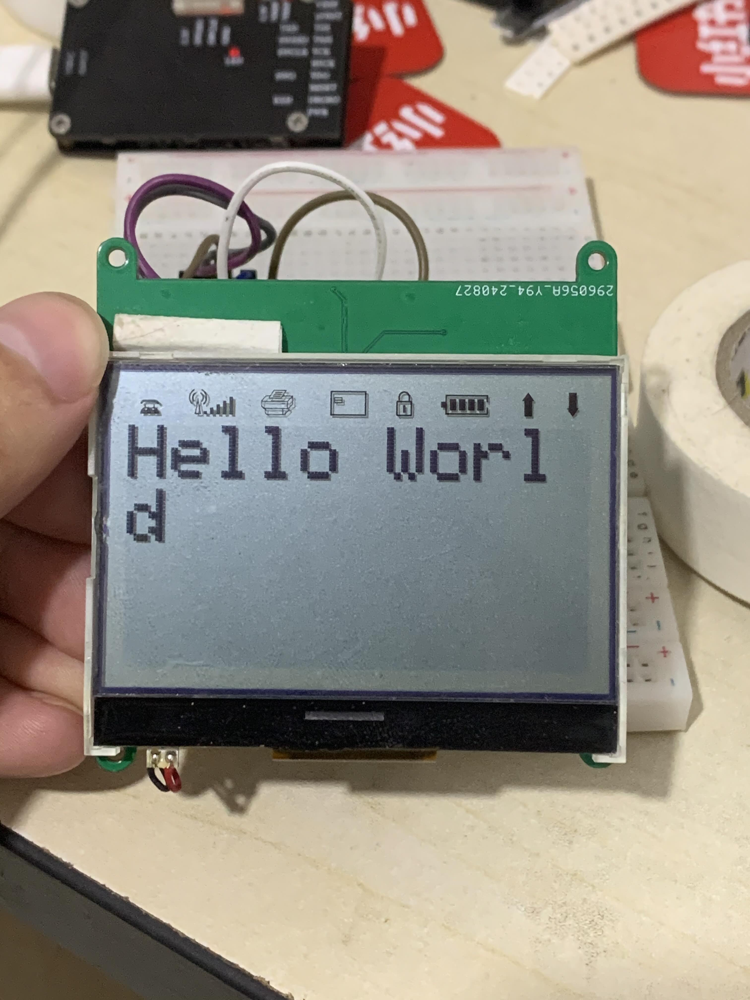

# ST7565P_Parallel

这是一个驱动程序，用于控制ST7565P LCD显示屏。它使用SPI接口与ST7565P通信，并提供简单的API来控制显示屏。

## 目录

- [简介](#简介)
- [特性](#特性)
- [安装](#安装)
- [使用](#使用)
- [贡献](#贡献)
- [许可证](#许可证)
- [联系](#联系)

## 简介

这是一款开源的驱动程序，用于控制ST7565P LCD显示屏。它使用8080接口与ST7565P通信，并提供简单的API来控制显示屏。可以绘制各种图形，包括线条、矩形、圆形、文本、位图等。

## 特性

- 特性1：支持多种字体
- 特性2：支持多种图形绘制
- 特性3：支持方向设置
- 特性4：支持显示缓存
- 特性5：支持多种显示模式

## 安装

提供安装步骤，确保用户能够顺利安装和运行项目。
# ST7565P_Parallel
